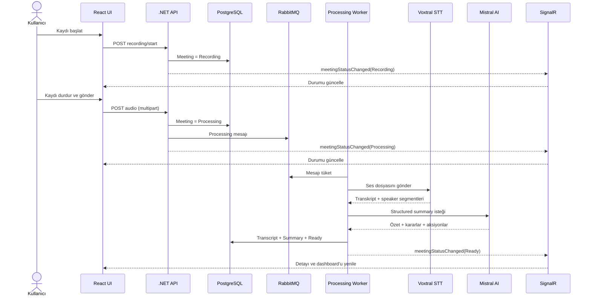
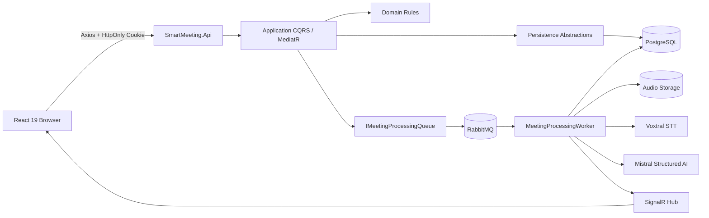

# SmartMeeting

> Toplantıları planlayan, konuşmayı metne dönüştüren ve toplantı sonrasında uygulanabilir aksiyonlara çeviren akıllı toplantı asistanı.

SmartMeeting; kurumsal toplantı süreçlerini tek bir akışta birleştirir: toplantı oluşturma, yetkili katılımcı yönetimi, canlı mikrofon kaydı, ses görselleştirmesi, konuşmacı ayrımı, Mistral AI özetleme, aksiyon takibi ve e-posta paylaşımı.

Uygulama; .NET 8 Clean Architecture + CQRS tabanlı backend ve React 19 + TypeScript tabanlı feature-oriented frontend ile geliştirilmiştir.

## ✨ Öne Çıkan Deneyim

- Günlük toplantı akışını ve istatistikleri gösteren akıllı dashboard
- Toplantı yöneticileri için planlama ve katılımcı yetkilendirme
- Tek tıkla canlı mikrofon kaydı
- Kayıt süresi sayacı ve gerçek zamanlı ses frekans görselleştirmesi
- `Recording → Processing → Ready/Failed` işlem durumları
- Voxtral ile transkript ve konuşmacı zaman aralıkları
- Mistral structured output ile yönetici özeti, kararlar ve aksiyonlar
- Manuel aksiyon oluşturma, sorumlu atama, öncelik ve termin tarihi
- Normal kullanıcı, Toplantı Yöneticisi ve Global Manager rolleri
- RabbitMQ tabanlı arka plan işleme
- SignalR ile canlı toplantı durum güncellemeleri
- SMTP üzerinden toplantı özeti e-posta gönderimi
- HttpOnly cookie tabanlı kimlik doğrulama

## 🖼️ Uygulama Görselleri

Screenshot’ları daha sonra `docs/screenshots` klasörüne ekleyebilirsin. Yer tutucular:

| Ekran | Dosya |
|---|---|
| Dashboard | `docs/screenshots/dashboard.png` |
| Toplantılar | `docs/screenshots/meetings.png` |
| Canlı toplantı odası | `docs/screenshots/meeting-room.png` |
| Toplantı detayı ve AI özeti | `docs/screenshots/meeting-detail.png` |
| Aksiyonlarım | `docs/screenshots/my-actions.png` |
| Giriş | `docs/screenshots/login.png` |

Görseller eklendiğinde README’ye şu şekilde yerleştirilebilir:

```markdown


```

## 🏗️ Mimari

```text
SmartMeeting
├── src
│   ├── SmartMeeting.Domain          # Entity, value object, enum, domain rule
│   ├── SmartMeeting.Application     # CQRS, MediatR, validation, abstractions
│   ├── SmartMeeting.Persistence     # PostgreSQL, EF Core, migrations, Identity
│   ├── SmartMeeting.Infrastructure  # Mistral, Voxtral, RabbitMQ, SMTP, storage
│   └── SmartMeeting.Api             # Controllers, middleware, SignalR, DI
├── web                              # React 19 + TypeScript + Vite
├── tests
└── docs/screenshots                  # Sonradan eklenecek uygulama görselleri
```

Katman bağımlılıkları içeriye doğrudur. Domain katmanı dış kütüphanelere bağımlı değildir; Application katmanı yalnızca abstraction’lar üzerinden Infrastructure ve Persistence ile iletişim kurar.

### Backend

- .NET 8 Web API
- Clean Architecture
- MediatR tabanlı CQRS
- FluentValidation pipeline behavior
- Result pattern
- ASP.NET Core Identity
- HttpOnly JWT cookie
- Entity Framework Core + PostgreSQL
- RabbitMQ consumer/worker
- SignalR meeting status hub
- MailKit SMTP adapter

### Frontend

- React 19
- TypeScript strict mode
- Vite
- Material UI 9
- TanStack React Query v5
- React Hook Form + Zod
- Axios
- Microsoft SignalR client
- Web Audio API abstraction’ları: `useAudioRecorder`, `useAudioVisualizer`

## 🔄 Uçtan Uca İşleyiş Diyagramı



## 🧩 Katmanlar Arası Veri Akışı



## 👥 Roller ve Yetkiler

| Rol | Yetki |
|---|---|
| Normal kullanıcı | Kendisine açık toplantıları ve atanan aksiyonları görüntüler; kendi aksiyonlarını tamamlar |
| Toplantı yöneticisi | Toplantı oluşturur, katılımcı ekler, toplantı içi yetki verir, kayıt ve aksiyon yönetir |
| Global Manager | Tüm toplantıları ve tüm aksiyonları görür; tüm toplantılarda yönetim yetkisine sahiptir |

Toplantı oluşturucusu, katılımcıya toplantı içi yönetim yetkisi verebilir. Yetkili katılımcı kayıt, not, aksiyon ve konuşmacı işlemlerini yönetebilir. Katılımcı toplantıdan ayrılabilir; başka katılımcıların çıkarılması yalnızca toplantı yöneticisi veya Global Manager tarafından yapılabilir.

## 🧠 AI ve Ses İşleme

Varsayılan Mistral yapılandırması:

- Özetleme modeli: `ministral-3b-2512`
- Transkripsiyon modeli: `voxtral-mini-latest`
- Diarization: etkin
- Structured JSON output: etkin

AI çıktısı şu alanlarla modellenir:

- Yönetici özeti
- Ana kararlar
- Aksiyon açıklaması
- Sorumlu kullanıcı
- Termin tarihi
- Öncelik
- Tamamlanma durumu

## 🚀 Gereksinimler

- .NET SDK 8+
- Node.js 20+
- npm
- Docker Desktop
- PostgreSQL 16 container
- RabbitMQ 4 container
- Mistral API anahtarı

## ⚙️ Kurulum

### 1. Repository’yi hazırla

```powershell
git clone https://github.com/melihesensio99/smartmeeting.git
cd smartmeeting
```

### 2. Docker servislerini başlat

Docker Desktop açıkken:

```powershell
docker volume create smartmeeting-postgres-data
docker volume create smartmeeting-rabbitmq-data
docker compose up -d postgres rabbitmq
docker compose ps
```

Servisler:

- PostgreSQL: `localhost:5432`
- RabbitMQ AMQP: `localhost:5672`
- RabbitMQ Management UI: `http://localhost:15672`

### 3. Backend secret’larını tanımla

Secret’lar kaynak koda yazılmamalıdır. User Secrets kullan:

```powershell
dotnet user-secrets set "ConnectionStrings:Default" "Host=localhost;Port=5432;Database=smartmeeting;Username=smartmeeting;Password=<POSTGRES_PASSWORD>" --project src/SmartMeeting.Api
dotnet user-secrets set "RabbitMq:Username" "smartmeeting" --project src/SmartMeeting.Api
dotnet user-secrets set "RabbitMq:Password" "<RABBITMQ_PASSWORD>" --project src/SmartMeeting.Api
dotnet user-secrets set "Mistral:ApiKey" "<MISTRAL_API_KEY>" --project src/SmartMeeting.Api
dotnet user-secrets set "Authentication:SigningKey" "<AT_LEAST_32_CHARACTER_SECRET>" --project src/SmartMeeting.Api
```

Rol bazlı geliştirme kullanıcıları için:

```powershell
dotnet user-secrets set "Authorization:GlobalManagerEmails:0" "<GLOBAL_MANAGER_EMAIL>" --project src/SmartMeeting.Api
dotnet user-secrets set "Authorization:MeetingCreatorEmails:0" "<MEETING_CREATOR_EMAIL>" --project src/SmartMeeting.Api
```

### 4. API’yi çalıştır

```powershell
dotnet run --project src/SmartMeeting.Api --urls http://localhost:5080
```

API: `http://localhost:5080`

Sağlık kontrolleri:

- `GET /health`
- `GET /health/live`
- `GET /health/ready`

### 5. Frontend’i çalıştır

```powershell
cd web
npm install
npm run dev
```

Frontend: `http://localhost:5173`

İstersen `web/.env.example` dosyasını `web/.env` olarak kopyalayarak API adresini özelleştirebilirsin.

## 📧 SMTP Yapılandırması

SMTP varsayılan olarak kapalıdır. Gmail kullanırken normal hesap şifresi yerine Gmail App Password kullanılmalıdır:

```powershell
dotnet user-secrets set "Email:Enabled" "true" --project src/SmartMeeting.Api
dotnet user-secrets set "Email:Host" "smtp.gmail.com" --project src/SmartMeeting.Api
dotnet user-secrets set "Email:Port" "587" --project src/SmartMeeting.Api
dotnet user-secrets set "Email:UseSsl" "true" --project src/SmartMeeting.Api
dotnet user-secrets set "Email:Username" "<SMTP_USERNAME>" --project src/SmartMeeting.Api
dotnet user-secrets set "Email:Password" "<GMAIL_APP_PASSWORD>" --project src/SmartMeeting.Api
dotnet user-secrets set "Email:FromAddress" "<FROM_ADDRESS>" --project src/SmartMeeting.Api
```

Özet e-posta endpoint’i:

```text
POST /api/meetings/{meetingId}/summary/email
```

## 🧪 Testler

Backend:

```powershell
dotnet test SmartMeeting.slnx --no-restore
```

Frontend:

```powershell
cd web
npm run lint
npm run test -- --run
npm run build
```

Test kapsamı:

- Domain yaşam döngüsü ve kurallar
- Domain event üretimi
- Katılımcı idempotency’si
- CQRS handler’ları
- FluentValidation kuralları
- Rol ve yetki kontrolleri
- RabbitMQ queue adapter’ı
- PostgreSQL/HTTP API entegrasyon akışları
- Frontend aksiyon, toplantı, recorder ve shell bileşenleri

## 📡 Önemli API Akışları

```text
POST /api/auth/register
POST /api/auth/login
POST /api/auth/logout
GET  /api/auth/me

GET  /api/meetings
POST /api/meetings
GET  /api/meetings/{meetingId}

POST /api/meetings/{meetingId}/recording/start
POST /api/meetings/{meetingId}/audio
POST /api/meetings/{meetingId}/processing/retry

POST /api/meetings/{meetingId}/participants
PUT  /api/meetings/{meetingId}/participants/{participantId}/management-permission
DELETE /api/meetings/{meetingId}/participants/me

POST /api/meetings/{meetingId}/action-items
PUT  /api/meetings/{meetingId}/action-items/{actionItemId}
POST /api/meetings/{meetingId}/action-items/{actionItemId}/complete
```

SignalR hub:

```text
/hubs/meeting-status
```

İstemci `JoinMeeting` metoduyla toplantı grubuna katılır; `meetingStatusChanged` eventi geldiğinde toplantı verisi React Query üzerinden yenilenir.

## 🔐 Güvenlik Notları

- JWT yalnızca HttpOnly cookie içinde taşınır.
- Frontend token’ı okuyamaz veya localStorage’a yazmaz.
- Secret, API key, SMTP App Password ve JWT signing key kaynak koda eklenmemelidir.
- Production ortamında HTTPS zorunludur.
- Production CORS origin’leri yalnızca HTTPS olmalıdır.
- PostgreSQL ve RabbitMQ ayrı kullanıcı/parola ile çalıştırılmalıdır.
- Data Protection key’leri kalıcı volume veya güvenli secret store’da tutulmalıdır.

## 📁 Ses Dosyası Depolama

Geliştirme ortamında ses dosyaları `src/SmartMeeting.Api/data/audio/yyyy.MM.dd/` altında tutulur. Ses dosyaları PostgreSQL’e binary olarak yazılmaz. `IAudioStorage` abstraction’ı sayesinde production’da Azure Blob Storage veya S3-compatible object storage adapter’ı kullanılabilir.

## 🛠️ Geliştirme İlkeleri

- Domain katmanında EF Core veya harici servis bağımlılığı bulunmaz.
- Application katmanı use-case ve abstraction’lardan oluşur.
- Controller’lar iş mantığı içermez; MediatR üzerinden handler çağırır.
- Tüm request’ler FluentValidation pipeline’ından geçer.
- Uzun süren STT/AI işlemleri request thread’inde çalışmaz.
- Server state yalnızca TanStack React Query ile yönetilir.
- API modelleri frontend’de Zod ile doğrulanır.
- React bileşenleri doğrudan `fetch` veya `useEffect` API çağrısı yapmaz.
- Commit’ler mantıksal parçalara ayrılır ve açıklayıcı Türkçe mesajlarla oluşturulur.

## 📄 Lisans

Bu repository kişisel/kurumsal geliştirme ve demo amaçlıdır. Lisans koşulları ayrıca belirtilmedikçe tüm hakları saklıdır.
