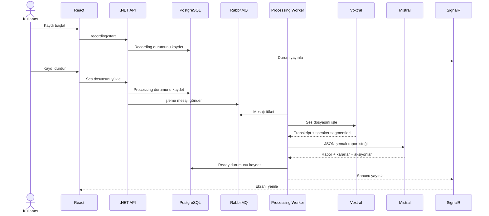

# Meeting | Toplantıdan Sonuca

Meeting, toplantı sonrasında “ne konuşuldu?” sorusunu “şimdi ne yapılacak?” cevabına dönüştüren kurumsal bir çalışma alanıdır.

Takvimden başlayan akış; kayıt, konuşmacılı transkript, Türkçe AI raporu, kararlar ve sorumlusu belli aksiyonlarla tamamlanır. Ekip üyeleri toplantı içindeki rollerini ve kendilerine atanan işleri tek yerden takip eder.

> Toplantı notu değil, toplantıdan çıkan sonucu yönet.

---

## 🎯 Neden Meeting?

Meeting dört ayrı ihtiyacı tek bir akışta birleştirir:

- **Planlama:** Toplantı oluşturma, katılımcı ekleme ve toplantı içi yetki verme.
- **Kayıt:** Tarayıcı mikrofonu, süre sayacı ve canlı ses görselleştirmesi.
- **Anlama:** Voxtral transkript, konuşmacı segmentleri ve Mistral destekli Türkçe rapor.
- **Takip:** Kararlar, sorumlular, öncelikler, termin tarihleri ve e-posta paylaşımı.

Bu yaklaşım toplantı bittikten sonra not arama ihtiyacını azaltır; ekip için görünür, ölçülebilir ve takip edilebilir bir çıktı üretir.

## 🧭 Toplantının Yaşam Döngüsü

```text
Planla → Yetkilendir → Kaydet → İşle → Raporla → Takip et
   │          │          │        │         │
   │          │          │        │         └─ Aksiyonlarım
   │          │          │        └─ Mistral raporu
   │          │          └─ RabbitMQ worker
   │          └─ Katılımcı yönetimi
   └─ Dashboard ve toplantı takvimi
```

Toplantı işleme durumu kullanıcıya açık şekilde gösterilir:

```text
Scheduled → Recording → Processing → Ready
                                      └→ Failed → Retry
```

## 🧰 Ürün Modülleri

### 📊 Dashboard

Günün toplantılarını ve ekip önceliklerini tek bakışta gör:

- 📅 Günlük toplantı akışı ve saat bilgileri
- 📈 Toplam toplantı, hazır rapor ve açık aksiyon istatistikleri
- 🔎 Toplantı detayına hızlı geçiş
- 🎙️ Dashboard’dan yeni kayıt başlatma

### 🎙️ Canlı toplantı odası

Toplantı sırasında ihtiyaç duyulan temel araçlar aynı ekranda:

- ✅ Kayıt öncesi toplantı ve yetki kontrolü
- ⏱️ Gerçek zamanlı kayıt süresi sayacı
- 🌊 Ses frekanslarını gösteren canlı dalga formu
- 📝 Kişisel toplantı notları
- 📤 Kayıt bitince otomatik işleme kuyruğuna gönderim

### 📝 Transkript ve AI raporu

Voxtral ses kaydını konuşmacı segmentleriyle işler; Mistral ise yapılandırılmış bir toplantı raporu üretir:

- 🤖 Yönetici özeti
- 💬 Öne çıkan görüşmeler
- ✅ Alınan kararlar
- ⚠️ Açık konular ve riskler
- 🎯 Sorumlu, öncelik ve termin içeren aksiyonlar

### ✅ Aksiyonlarım

Toplantıdan çıkan işleri görünür ve takip edilebilir hale getirir:

- 🧠 AI tarafından çıkarılan aksiyonlar
- ✍️ Yöneticinin elle eklediği görevler
- 👤 Sorumlu kullanıcı bilgisi
- 🚦 Düşük, orta ve yüksek öncelik rozetleri
- 📆 Termin tarihi
- ☑️ Toplantı sonrasında da tamamlanabilen görevler

### 👥 Ekip erişimi

Toplantıdaki rol ve sorumluluklar açıkça yönetilir:

- 🔐 Yalnızca kayıtlı kullanıcıları davet etme
- 🛡️ Katılımcıya toplantı içi yönetim izni verme
- 🚪 Katılımcının kendi toplantı katılımını sonlandırabilmesi
- 👑 Global Manager için tüm toplantı ve aksiyon görünümü

---

## 🖼️ Ekran Galerisi

Gerçek ekran görüntüleri aşağıdaki dosya adlarıyla sonradan eklenebilir:

| Akış | Görsel |
|---|---|
| Dashboard | `docs/screenshots/dashboard.png` |
| Giriş | `docs/screenshots/login.png` |
| Toplantı listesi | `docs/screenshots/meetings.png` |
| Canlı oda | `docs/screenshots/meeting-room.png` |
| Transkript ve AI raporu | `docs/screenshots/meeting-detail.png` |
| Aksiyonlarım | `docs/screenshots/my-actions.png` |

Örnek:

```markdown

```

---

## 🧱 Mimari Yaklaşım

```text
Meeting
├── src
│   ├── SmartMeeting.Domain          # İş kuralları ve domain modelleri
│   ├── SmartMeeting.Application     # CQRS, use-case ve abstraction'lar
│   ├── SmartMeeting.Persistence     # PostgreSQL, EF Core ve Identity
│   ├── SmartMeeting.Infrastructure  # AI, queue, SMTP ve storage adapter'ları
│   └── SmartMeeting.Api             # HTTP, SignalR, middleware ve DI
├── web                              # React feature modülleri
├── tests                            # Katman bazlı test projeleri
└── docs/screenshots                 # Ürün görselleri
```

Bağımlılık yönü dışarıdan içeriye doğrudur. Domain hiçbir altyapı kütüphanesini bilmez. Application, dış servisleri abstraction’larla tanımlar. Persistence ve Infrastructure bu sözleşmeleri uygular; API ise orkestrasyon ve taşıma katmanıdır.

### Teknoloji seçimi

| Alan | Kullanılan teknoloji |
|---|---|
| UI | React 19, TypeScript, Vite 8, Material UI 9 |
| Server state | TanStack React Query v5 |
| Form doğrulama | React Hook Form, Zod |
| Backend | .NET 8, MediatR, FluentValidation |
| Veri | PostgreSQL, Entity Framework Core |
| İşleme kuyruğu | RabbitMQ, Background Worker |
| Gerçek zamanlı iletişim | SignalR |
| AI / STT | Mistral AI, Voxtral |
| E-posta | MailKit SMTP |
| Kimlik | ASP.NET Core Identity, HttpOnly JWT cookie |

## 🔄 Ses Kaydından Raporlamaya



---

## 👥 Yetki Modeli

| Kullanıcı tipi | Yapabildikleri |
|---|---|
| Normal kullanıcı | Kendisine açık toplantıları ve atanan aksiyonları görür; kendi aksiyonlarını tamamlar. |
| Toplantı yöneticisi | Toplantı oluşturur, katılımcı ekler, yetki verir, kayıt ve aksiyon yönetir. |
| Global Manager | Tüm toplantıları ve aksiyonları görür; toplantı yönetimi yapabilir. |

Kullanıcılar yalnızca sistemde kayıtlı hesaplardan seçilebilir. Katılımcı çıkarma yetkisi toplantı yöneticisi veya Global Manager’dadır. Katılımcı kendi toplantı katılımını sonlandırabilir.

---

## 🚀 Yerel Kurulum

### Gereksinimler

- .NET SDK 8+
- Node.js 20+ ve npm
- Docker Desktop
- Mistral API anahtarı

### Altyapı servisleri

```powershell
git clone https://github.com/melihesensio99/smartmeeting.git
cd smartmeeting

docker volume create smartmeeting-postgres-data
docker volume create smartmeeting-rabbitmq-data
docker compose up -d postgres rabbitmq
docker compose ps
```

Adresler:

- PostgreSQL: `localhost:5432`
- RabbitMQ: `localhost:5672`
- RabbitMQ Management UI: `http://localhost:15672`

### Secret yapılandırması

Secret’lar kaynak koda yazılmamalıdır:

```powershell
dotnet user-secrets set "ConnectionStrings:Default" "Host=localhost;Port=5432;Database=smartmeeting;Username=smartmeeting;Password=<POSTGRES_PASSWORD>" --project src/SmartMeeting.Api
dotnet user-secrets set "RabbitMq:Password" "<RABBITMQ_PASSWORD>" --project src/SmartMeeting.Api
dotnet user-secrets set "Mistral:ApiKey" "<MISTRAL_API_KEY>" --project src/SmartMeeting.Api
dotnet user-secrets set "Authentication:SigningKey" "<AT_LEAST_32_CHARACTER_SECRET>" --project src/SmartMeeting.Api
```

### Uygulamayı çalıştır

Terminal 1:

```powershell
dotnet run --project src/SmartMeeting.Api --urls http://localhost:5080
```

Terminal 2:

```powershell
cd web
npm install
npm run dev
```

- API: `http://localhost:5080`
- Frontend: `http://localhost:5173`
- Sağlık: `/health`, `/health/live`, `/health/ready`

---

## 📬 E-posta Çıkışı

Gmail ile gönderim için normal hesap şifresi yerine App Password kullanılır:

```powershell
dotnet user-secrets set "Email:Enabled" "true" --project src/SmartMeeting.Api
dotnet user-secrets set "Email:Username" "<SMTP_USERNAME>" --project src/SmartMeeting.Api
dotnet user-secrets set "Email:Password" "<GMAIL_APP_PASSWORD>" --project src/SmartMeeting.Api
dotnet user-secrets set "Email:FromAddress" "<FROM_ADDRESS>" --project src/SmartMeeting.Api
```

---

## 🧪 Kalite Kontrolleri

Backend:

```powershell
dotnet test SmartMeeting.slnx --no-restore
```

Frontend:

```powershell
cd web
npm run lint
npm run test -- --run
npm run build
```

Testler domain kurallarını, CQRS handler’larını, validation akışını, kimlik ve yetki kontrollerini, RabbitMQ worker’ını, Mistral sözleşmelerini, SMTP akışını, API entegrasyonlarını ve React bileşenlerini kapsar.

## 📡 API ve Gerçek Zamanlı Kanal

```text
POST /api/auth/register
POST /api/auth/login
POST /api/auth/logout
GET  /api/auth/me

GET  /api/meetings
POST /api/meetings
GET  /api/meetings/{meetingId}

POST /api/meetings/{meetingId}/recording/start
POST /api/meetings/{meetingId}/audio
POST /api/meetings/{meetingId}/processing/retry

POST /api/meetings/{meetingId}/participants
PUT  /api/meetings/{meetingId}/participants/{participantId}/management-permission
DELETE /api/meetings/{meetingId}/participants/me

POST /api/meetings/{meetingId}/action-items
PUT  /api/meetings/{meetingId}/action-items/{actionItemId}
POST /api/meetings/{meetingId}/action-items/{actionItemId}/complete
```

SignalR hub: `/hubs/meeting-status`

## 🔐 Güvenlik ve Veri

- JWT yalnızca HttpOnly cookie içinde taşınır.
- Production ortamında HTTPS ve Secure cookie zorunludur.
- API key, SMTP App Password, JWT signing key ve veritabanı parolası kaynak koda eklenmez.
- Ses dosyaları geliştirmede `data/audio/yyyy.MM.dd/` altında tutulur.
- `IAudioStorage` abstraction’ı S3 veya Azure Blob adapter’ına geçişe izin verir.
- Uzun süren STT ve AI işlemleri HTTP isteğinde değil, RabbitMQ worker üzerinden yürütülür.

## 📄 Lisans

Bu repository kişisel ve kurumsal geliştirme amacıyla hazırlanmıştır. Lisans koşulları ayrıca belirtilmedikçe tüm hakları saklıdır.
