# Meeting | Toplantıdan Sonuca

Meeting, toplantı sonrasında “ne konuşuldu?” sorusunu “şimdi ne yapılacak?” cevabına dönüştüren kurumsal bir çalışma alanıdır.

Takvimden başlayan akış; kayıt, konuşmacılı transkript, Türkçe AI raporu, kararlar ve sorumlusu belli aksiyonlarla tamamlanır. Ekip üyeleri toplantı içindeki rollerini ve kendilerine atanan işleri tek yerden takip eder.

> Toplantı notu değil, toplantıdan çıkan sonucu yönet.

## 🧰 Teknoloji Yığını


Frontend; React, TypeScript, Vite, Material UI ve TanStack Query ile geliştirildi. Backend; .NET 8, Clean Architecture, CQRS/MediatR ve FluentValidation kullanır. PostgreSQL kalıcı veriyi, RabbitMQ uzun süren ses/AI işlemlerini, SignalR ise toplantı odası presence ve gerçek zamanlı olayları yönetir. Ses kaydı Voxtral ile metne çevrilir; Mistral AI özet, karar ve aksiyonları üretir.

---

## 🎯 Neden Meeting?

Meeting dört ayrı ihtiyacı tek bir akışta birleştirir:

- **Planlama:** Toplantı oluşturma, katılımcı ekleme ve toplantı içi yetki verme.
- **Kayıt:** Tarayıcı mikrofonu, süre sayacı ve canlı ses görselleştirmesi.
- **Anlama:** Voxtral transkript, konuşmacı segmentleri ve Mistral destekli Türkçe rapor.
- **Takip:** Kararlar, sorumlular, öncelikler, termin tarihleri ve e-posta paylaşımı.

Bu yaklaşım toplantı bittikten sonra not arama ihtiyacını azaltır; ekip için görünür, ölçülebilir ve takip edilebilir bir çıktı üretir.

## 🧭 Toplantının Yaşam Döngüsü

```text
Planla → Yetkilendir → Kaydet → İşle → Raporla → Takip et
   │          │          │        │         │
   │          │          │        │         └─ Aksiyonlarım
   │          │          │        └─ Mistral raporu
   │          │          └─ RabbitMQ worker
   │          └─ Katılımcı yönetimi
   └─ Dashboard ve toplantı takvimi
```

Toplantı işleme durumu kullanıcıya açık şekilde gösterilir:

```text
Scheduled → Recording → Processing → Ready
                                      └→ Failed → Retry
```

## 🧰 Ürün Modülleri

### 📊 Dashboard

Günün toplantılarını ve ekip önceliklerini tek bakışta gör:

- 📅 Günlük toplantı akışı ve saat bilgileri
- 📈 Toplam toplantı, hazır rapor ve açık aksiyon istatistikleri
- 🔎 Toplantı detayına hızlı geçiş
- 🎙️ Dashboard’dan yeni kayıt başlatma

### 🎙️ Canlı toplantı odası

Toplantı sırasında ihtiyaç duyulan temel araçlar aynı ekranda:

- ✅ Kayıt öncesi toplantı ve yetki kontrolü
- ⏱️ Gerçek zamanlı kayıt süresi sayacı
- 🌊 Ses frekanslarını gösteren canlı dalga formu
- 📝 Kişisel toplantı notları
- 📤 Kayıt bitince otomatik işleme kuyruğuna gönderim

### 📝 Transkript ve AI raporu

Voxtral ses kaydını konuşmacı segmentleriyle işler; Mistral ise yapılandırılmış bir toplantı raporu üretir:

- 🤖 Yönetici özeti
- 💬 Öne çıkan görüşmeler
- ✅ Alınan kararlar
- ⚠️ Açık konular ve riskler
- 🎯 Sorumlu, öncelik ve termin içeren aksiyonlar

### ✅ Aksiyonlarım

Toplantıdan çıkan işleri görünür ve takip edilebilir hale getirir:

- 🧠 AI tarafından çıkarılan aksiyonlar
- ✍️ Yöneticinin elle eklediği görevler
- 👤 Sorumlu kullanıcı bilgisi
- 🚦 Düşük, orta ve yüksek öncelik rozetleri
- 📆 Termin tarihi
- ☑️ Toplantı sonrasında da tamamlanabilen görevler

### 👥 Ekip erişimi

Toplantıdaki rol ve sorumluluklar açıkça yönetilir:

- 🔐 Yalnızca kayıtlı kullanıcıları davet etme
- 🛡️ Katılımcıya toplantı içi yönetim izni verme
- 🚪 Katılımcının kendi toplantı katılımını sonlandırabilmesi
- 👑 Global Manager için tüm toplantı ve aksiyon görünümü

---

## 🖼️ Ekran Galerisi

Uygulamanın ana akışları gerçek ekran görüntüleriyle aşağıda gösterilmiştir. Görseller [`docs/screenshots`](docs/screenshots) klasöründe tutulur.

### 🔐 Giriş ve başlangıç ekranları

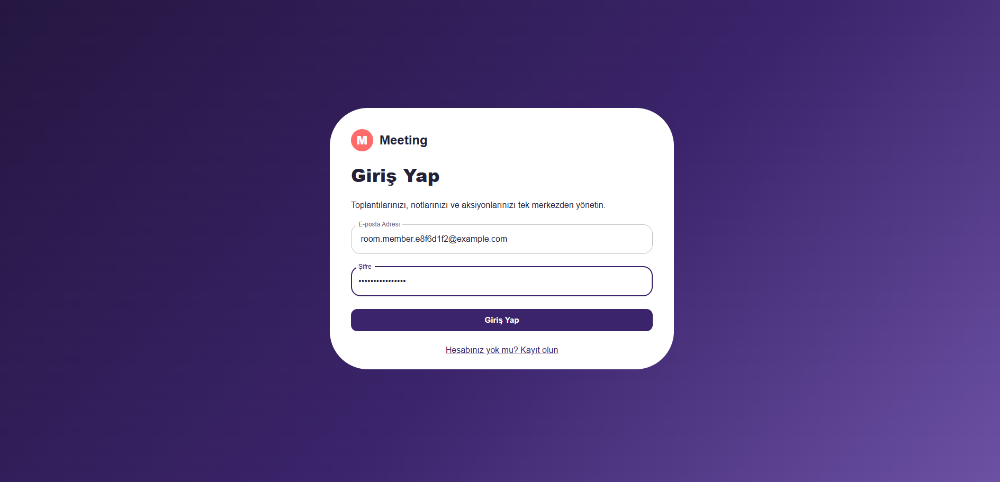

Kullanıcılar kimlik doğrulama olmadan uygulama sayfalarına erişemez. HttpOnly cookie tabanlı oturum ile yetki bilgisi API tarafından doğrulanır.

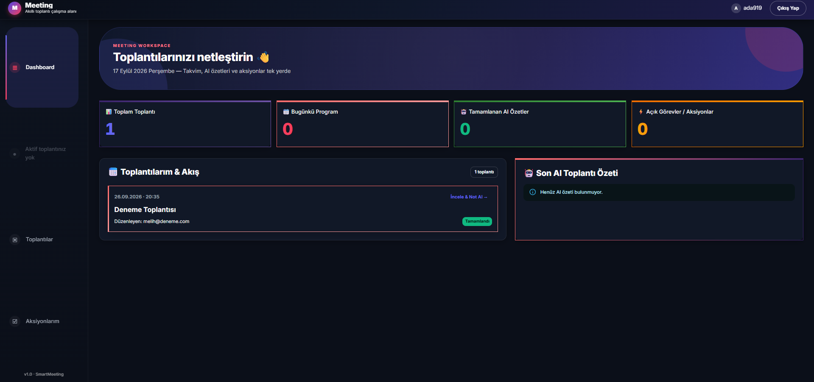

Dashboard; kullanıcının dahil olduğu toplantıları, günlük akışı, tamamlanan AI özetlerini ve açık aksiyonlarını tek bakışta sunar.

### 📅 Toplantı oluşturma ve katılımcılar

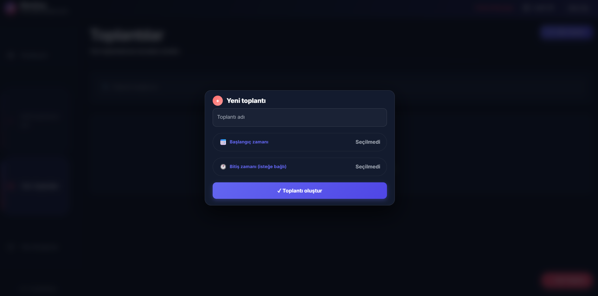

Toplantı oluşturma akışı tarih aralığı, toplantı başlığı ve planlama bilgilerini tek formda toplar.

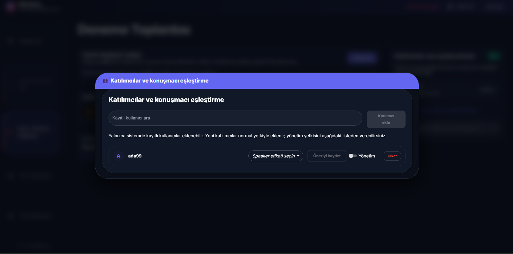

Katılımcılar yalnızca kayıtlı kullanıcılar arasından seçilir; toplu seçim desteklenir ve toplantı yöneticisi yetkileri ayrı yönetilir.

### 🎥 Toplantı odası ve canlı kayıt

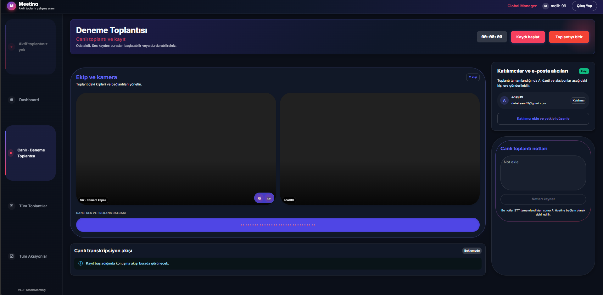

Toplantı odası, WebRTC medya akışlarını ve katılımcı presence bilgisini aynı çalışma alanında gösterir. Kamera ve mikrofon kontrolleri oda içinden yönetilir.

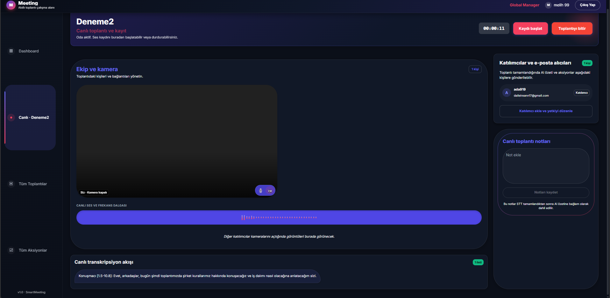

Kayıt yöneticinin kontrolündedir. Ses kaydı tamamlandığında dosya API’ye yüklenir, RabbitMQ kuyruğuna alınır ve Voxtral transkripsiyon worker’ı tarafından işlenir.

### 🤖 AI özeti ve aksiyon yönetimi

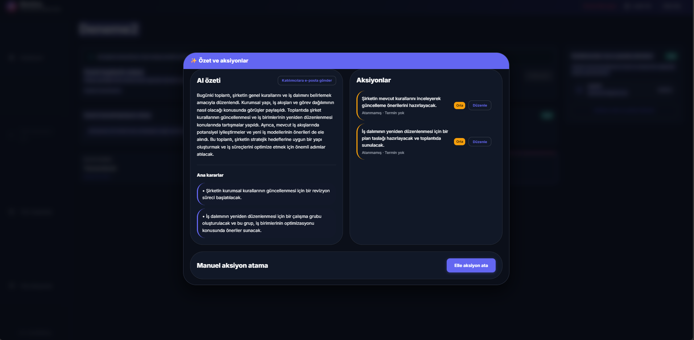

Mistral AI transkriptten özet, karar ve aksiyonlar çıkarır. Aksiyonlar toplantıya katılan kullanıcılara atanabilir; sorumlu, öncelik ve termin bilgileri düzenlenebilir.

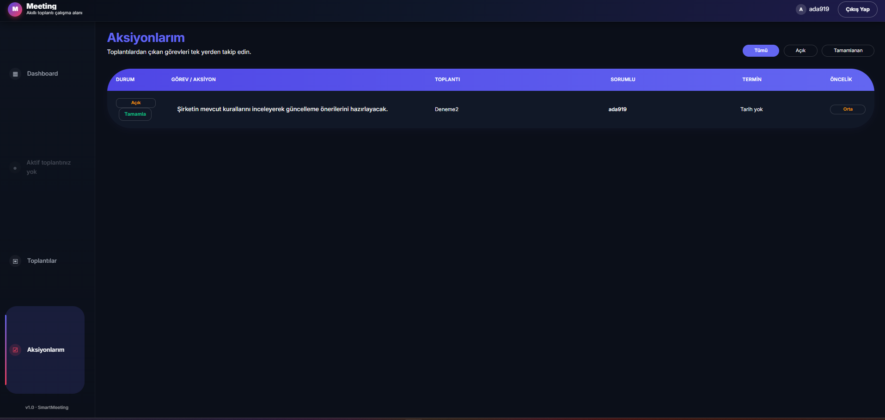

Global Manager tüm aksiyonları, sorumlularını ve toplantı ilişkisini görebilir. Atanan kullanıcı kendi aksiyonunu tamamlandı durumuna çekebilir.

### ✅ Toplantı sonu ve e-posta çıktısı

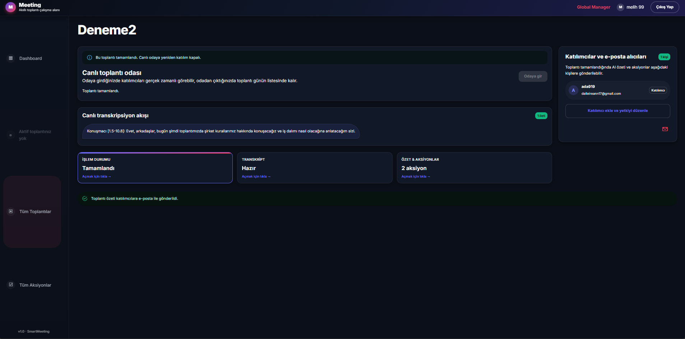

Toplantı sonlandırıldığında canlı odaya yeniden giriş kapatılır; toplantı geçmişte tutulur ve transkript/AI sonuçları okunmaya devam eder.

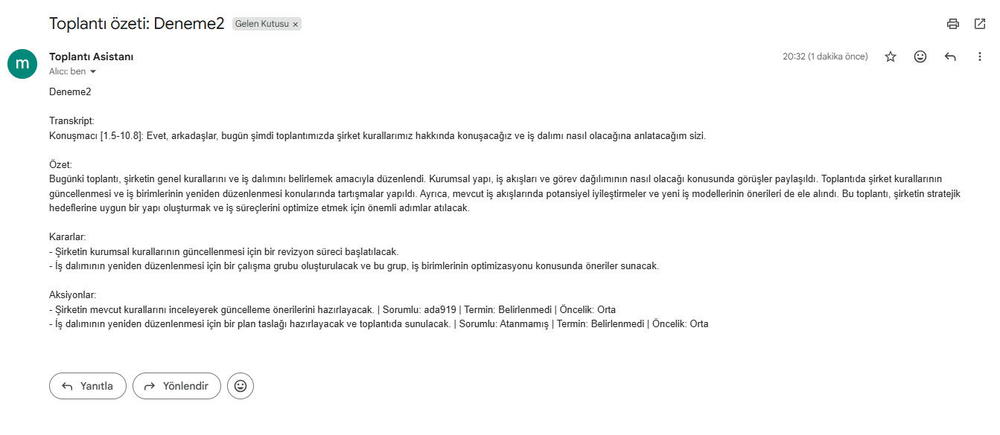

Hazır transkript, AI özeti, kararlar ve aksiyonlar toplantının kayıtlı e-posta alıcılarına gönderilebilir. Gönderim yetkisi toplantı yöneticisi ve Global Manager ile sınırlıdır.

### 📚 API dokümantasyonu

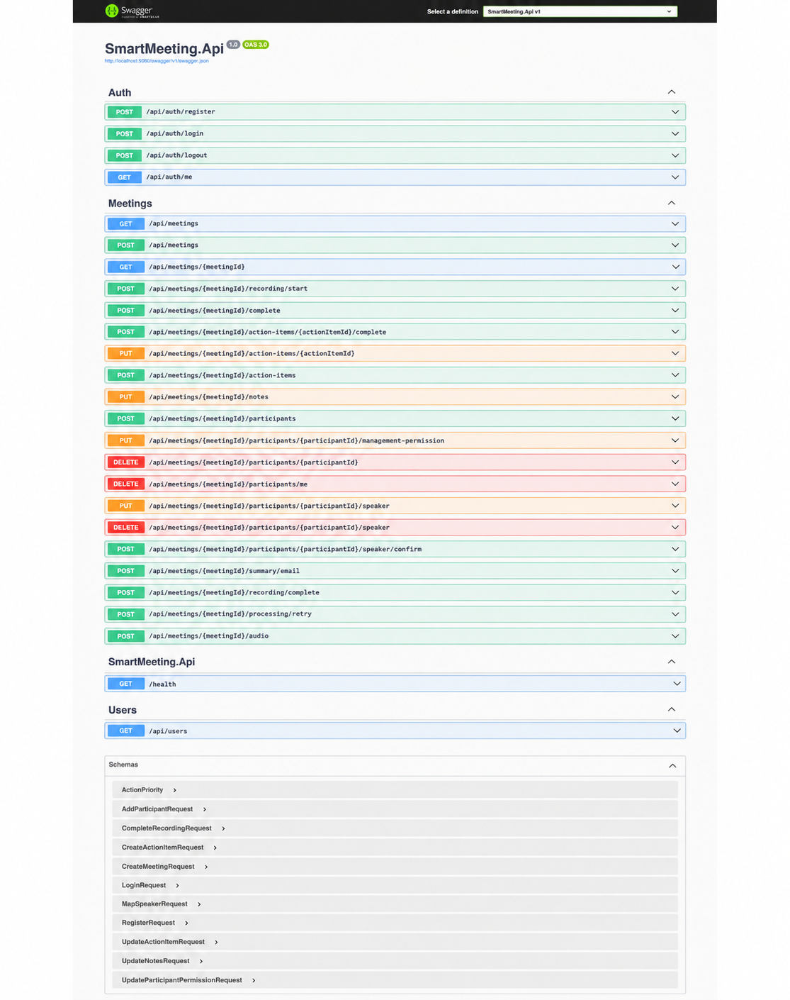

Swagger UI, authentication, toplantılar, katılımcılar, kayıt/işleme, konuşmacı eşleştirme ve aksiyon endpoint’lerini request/response modelleriyle listeler.

### 🎬 İki kullanıcıyla canlı oda akışı

Yerel demo akışı şu sırayla ilerler:

1. 👤 Toplantı oluşturucu toplantıyı oluşturur.
2. ➕ Toplantı sahibi kayıtlı kullanıcıyı toplantıya ekler.
3. 🚪 Her iki kullanıcı toplantı detayından **Odaya gir** seçeneğini kullanır.
4. 🟢 Aktif katılımcılar SignalR ile anlık olarak birbirini görür.
5. 🎙️ Odaya girişte kamera kapalıdır; mikrofon bağlantısı kurulur.
6. 📹 Kullanıcı isterse **Kamerayı aç** düğmesiyle görüntülü görüşmeye geçer.
7. 🔇 Mikrofon/kamera kontrolleri ve **Odadan çık** akışı odanın içinden yönetilir.

WebRTC medya akışı katılımcılar arasında doğrudan taşınır; SignalR yalnızca oda presence bilgisi ve WebRTC sinyalleşmesi için kullanılır. Tarayıcı izinleri verilmeden kamera açılmaz.

Akışı manuel doğrulama adımları için [`docs/demo/meeting-room-flow.md`](docs/demo/meeting-room-flow.md) dosyasına bakabilirsiniz.

---

## 🧱 Mimari Yaklaşım

```text
Meeting
├── src
│   ├── SmartMeeting.Domain          # İş kuralları ve domain modelleri
│   ├── SmartMeeting.Application     # CQRS, use-case ve abstraction'lar
│   ├── SmartMeeting.Persistence     # PostgreSQL, EF Core ve Identity
│   ├── SmartMeeting.Infrastructure  # AI, queue, SMTP ve storage adapter'ları
│   └── SmartMeeting.Api             # HTTP, SignalR, middleware ve DI
├── web                              # React feature modülleri
├── tests                            # Katman bazlı test projeleri
└── docs/screenshots                 # Ürün görselleri
```

Bağımlılık yönü dışarıdan içeriye doğrudur. Domain hiçbir altyapı kütüphanesini bilmez. Application, dış servisleri abstraction’larla tanımlar. Persistence ve Infrastructure bu sözleşmeleri uygular; API ise orkestrasyon ve taşıma katmanıdır.

### Teknoloji seçimi

| Alan | Kullanılan teknoloji |
|---|---|
| UI | React 19, TypeScript, Vite 8, Material UI 9 |
| Server state | TanStack React Query v5 |
| Form doğrulama | React Hook Form, Zod |
| Backend | .NET 8, MediatR, FluentValidation |
| Veri | PostgreSQL, Entity Framework Core |
| İşleme kuyruğu | RabbitMQ, Background Worker |
| Gerçek zamanlı iletişim | SignalR |
| AI / STT | Mistral AI, Voxtral |
| E-posta | MailKit SMTP |
| Kimlik | ASP.NET Core Identity, HttpOnly JWT cookie |

## 🔄 Ses Kaydından Raporlamaya

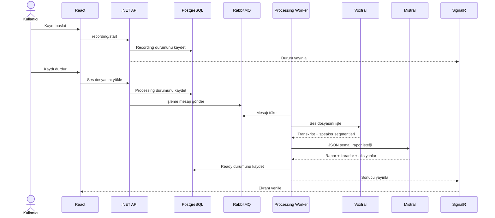

---

## 👥 Yetki Modeli

| Kullanıcı tipi | Yapabildikleri |
|---|---|
| Normal kullanıcı | Kendisine açık toplantıları ve atanan aksiyonları görür; kendi aksiyonlarını tamamlar. |
| Toplantı yöneticisi | Toplantı oluşturur, katılımcı ekler, yetki verir, kayıt ve aksiyon yönetir. |
| Global Manager | Tüm toplantıları ve aksiyonları görür; toplantı yönetimi yapabilir. |

Kullanıcılar yalnızca sistemde kayıtlı hesaplardan seçilebilir. Katılımcı çıkarma yetkisi toplantı yöneticisi veya Global Manager’dadır. Katılımcı kendi toplantı katılımını sonlandırabilir.

---

## 🚀 Yerel Kurulum

### Gereksinimler

- .NET SDK 8+
- Node.js 20+ ve npm
- Docker Desktop
- Mistral API anahtarı

### Altyapı servisleri

```powershell
git clone https://github.com/melihesensio99/smartmeeting.git
cd smartmeeting

docker volume create smartmeeting-postgres-data
docker volume create smartmeeting-rabbitmq-data
docker compose up -d postgres rabbitmq
docker compose ps
```

Adresler:

- PostgreSQL: `localhost:5432`
- RabbitMQ: `localhost:5672`
- RabbitMQ Management UI: `http://localhost:15672`

### Secret yapılandırması

Secret’lar kaynak koda yazılmamalıdır:

```powershell
dotnet user-secrets set "ConnectionStrings:Default" "Host=localhost;Port=5432;Database=smartmeeting;Username=smartmeeting;Password=<POSTGRES_PASSWORD>" --project src/SmartMeeting.Api
dotnet user-secrets set "RabbitMq:Password" "<RABBITMQ_PASSWORD>" --project src/SmartMeeting.Api
dotnet user-secrets set "Mistral:ApiKey" "<MISTRAL_API_KEY>" --project src/SmartMeeting.Api
dotnet user-secrets set "Authentication:SigningKey" "<AT_LEAST_32_CHARACTER_SECRET>" --project src/SmartMeeting.Api
```

### Uygulamayı çalıştır

Terminal 1:

```powershell
dotnet run --project src/SmartMeeting.Api --urls http://localhost:5080
```

Terminal 2:

```powershell
cd web
npm install
npm run dev
```

- API: `http://localhost:5080`
- Frontend: `http://localhost:5173`
- Sağlık: `/health`, `/health/live`, `/health/ready`

---

## 📬 E-posta Çıkışı

Gmail ile gönderim için normal hesap şifresi yerine App Password kullanılır:

```powershell
dotnet user-secrets set "Email:Enabled" "true" --project src/SmartMeeting.Api
dotnet user-secrets set "Email:Username" "<SMTP_USERNAME>" --project src/SmartMeeting.Api
dotnet user-secrets set "Email:Password" "<GMAIL_APP_PASSWORD>" --project src/SmartMeeting.Api
dotnet user-secrets set "Email:FromAddress" "<FROM_ADDRESS>" --project src/SmartMeeting.Api
```

---

## 🧪 Kalite Kontrolleri

Backend:

```powershell
dotnet test SmartMeeting.slnx --no-restore
```

Frontend:

```powershell
cd web
npm run lint
npm run test -- --run
npm run build
```

Testler domain kurallarını, CQRS handler’larını, validation akışını, kimlik ve yetki kontrollerini, RabbitMQ worker’ını, Mistral sözleşmelerini, SMTP akışını, API entegrasyonlarını ve React bileşenlerini kapsar.

## 📡 Swagger API Dokümantasyonu

Development ortamında API, tüm controller endpoint’lerini ve request/response sözleşmelerini Swagger UI üzerinden sunar.

- Swagger UI: `http://localhost:5080/swagger`
- OpenAPI JSON: `http://localhost:5080/swagger/v1/swagger.json`
- Sağlık kontrolü: `http://localhost:5080/health`
- SignalR hub: `http://localhost:5080/hubs/meeting-status`

### Endpoint kataloğu

#### Kimlik ve kullanıcılar

```text
POST /api/auth/register
POST /api/auth/login
POST /api/auth/logout
GET  /api/auth/me
GET  /api/users?search={search}
```

#### Toplantılar

```text
GET  /api/meetings
POST /api/meetings
GET  /api/meetings/{meetingId}
PUT  /api/meetings/{meetingId}/notes
```

#### Kayıt, ses ve işleme

```text
POST /api/meetings/{meetingId}/recording/start
POST /api/meetings/{meetingId}/recording/complete
POST /api/meetings/{meetingId}/audio
POST /api/meetings/{meetingId}/processing/retry
POST /api/meetings/{meetingId}/complete
POST /api/meetings/{meetingId}/summary/email
```

#### Katılımcılar ve konuşmacı eşleştirme

```text
POST   /api/meetings/{meetingId}/participants
DELETE /api/meetings/{meetingId}/participants/me
DELETE /api/meetings/{meetingId}/participants/{participantId}
PUT    /api/meetings/{meetingId}/participants/{participantId}/management-permission
PUT    /api/meetings/{meetingId}/participants/{participantId}/speaker
POST   /api/meetings/{meetingId}/participants/{participantId}/speaker/confirm
DELETE /api/meetings/{meetingId}/participants/{participantId}/speaker
```

#### Aksiyonlar

```text
POST /api/meetings/{meetingId}/action-items
PUT  /api/meetings/{meetingId}/action-items/{actionItemId}
POST /api/meetings/{meetingId}/action-items/{actionItemId}/complete
```

Endpoint’lerin tamamı, güncel request/response modelleri ve yetkilendirme gereksinimleri için Swagger UI’daki ilgili işlemi genişletebilirsiniz.

Swagger ekran görüntüsü:


Swagger yalnızca Development ortamında etkinleştirilir; production ortamında API dokümantasyonu dışarıya açılmaz.

## 🔐 Güvenlik ve Veri

- JWT yalnızca HttpOnly cookie içinde taşınır.
- Production ortamında HTTPS ve Secure cookie zorunludur.
- API key, SMTP App Password, JWT signing key ve veritabanı parolası kaynak koda eklenmez.
- Ses dosyaları geliştirmede `data/audio/yyyy.MM.dd/` altında tutulur.
- `IAudioStorage` abstraction’ı S3 veya Azure Blob adapter’ına geçişe izin verir.
- Uzun süren STT ve AI işlemleri HTTP isteğinde değil, RabbitMQ worker üzerinden yürütülür.

## 📄 Lisans

Bu repository kişisel ve kurumsal geliştirme amacıyla hazırlanmıştır. Lisans koşulları ayrıca belirtilmedikçe tüm hakları saklıdır.
